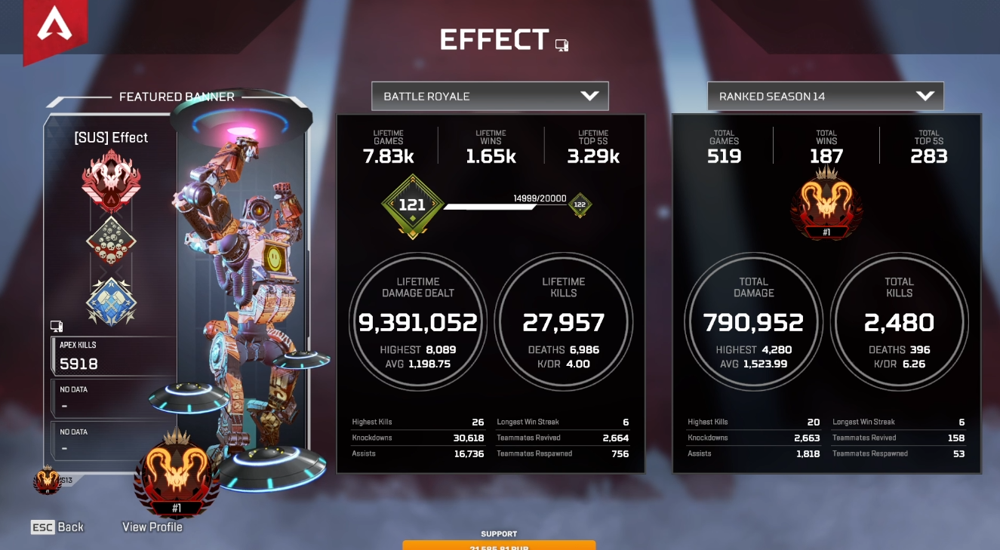
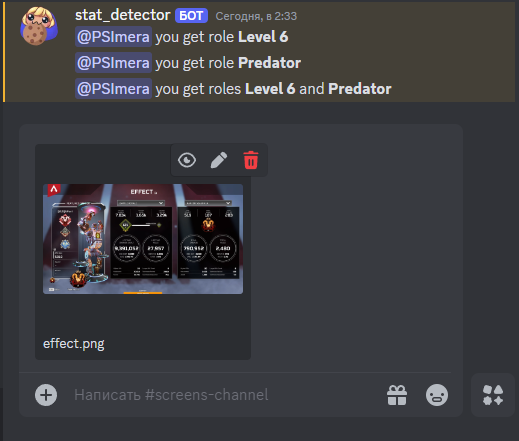
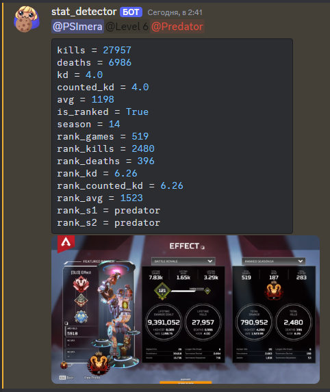
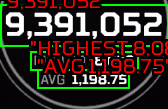
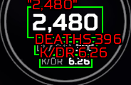
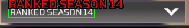
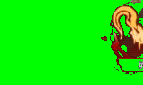
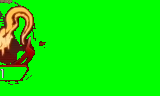

# AI Apex Stat Detector <a href="https://discordapp.com/" target="_blank">Discord</a> Bot

> <a href="README.MD" target="_blank">**English version**</a>



Данный бот принимает изображение со скриншотом статистики, читает информацию с этого скриншота и на основании этой статистики даёт пользователю роль или две роли в зависимости от режима работы.



Роль Skill на основании скила и роль Rank на основании его максимального ранга в сезоне.
Сообщения со скриншотами необходимо присылать в одном канале. Бот сразу удаляет это сообщение и отвечает пользователю о выданых ему ролях.



Бот сохраняет присланое изображение в канал логов сопровождая прочитанной информацией и указывает выданные роли. Предполагается что канал логов видят только админы для того чтобы люди не стеснялись скидывать свою статистику в публичном канале, но вы можете сохранять этот лог и в том же самом канале.


# Использование

- Создай бота на <a href="https://discordapp.com/developers/applications/" target="_blank">DiscordDevelopers</a> и скопируй токен
- Вставь токен в фаил `.env` в корневой папке строкой `TOKEN = '<ваш токен>'` (<a href=".env.example" target="_blank">пример</a>) 
- Для старта запустите <a href="main.py" target="_blank">main.py</a>

Если вы собираетесь хостить бота на сервере или вы просто не хотите устанавливать в систему всё необходимое окружение и у вас нет видеокарты с поддержкой CUDA, то самый простой способ это использование docker

`docker pull psimera/apex-stat-detector-bot`

В контейнер докера необходимо так же скопировать фаил `.env` с вашим токеном 

`docker cp <путь_к/.env> <имя контейнера>:/bot`

Если же вы собираетесь запустить его локально и если на машине присутствует видеокарта **NVIDIA**, то Вы можете запустить бота используя **CUDA**, что даст знеачительный прирост в скорости работы. Для этого должны быть установлены <a href="https://developer.nvidia.com/cuda-toolkit" target="_blank">**CUDA® Toolkit**</a>, <a href="https://developer.nvidia.com/cudnn" target="_blank">**cuDNN**</a> и <a href="https://pytorch.org/get-started/locally/" target="_blank">**Torch**</a> версия с поддержкой GPU

> Протестировано на **Python 3.9**, **CUDA 11.8** и версиях библиотек указанных в <a href="requirementsGPU.txt" target="_blank">requirementsGPU.txt</a>


## Ограничения

- Бот работает с разрешением 1280x720 и более (но если хочется это ограничение убрать, это легко найти в коде. Скорее всего бот будет находить информацию и на более мелких изображениях, но я добавил это ограничение чтобы отсеять плохого качества скрины)
- Качество изображения влияет на качество чтения информации, так что качество должно быть хорошим (не фото экрана например)
- Бот плохо работает с растянутыми изображениями (stretched res), скорее всего выдаст ошибку
- Бот плохо воспринимает информацию (в основном ранг) с изображений с искаженными цветами
- Необходимо чтобы во время скриншота вся информация была видна и наведённая мышка в какой-то области не выводила всплывающего окна, которое перекрывает информацию
- Язык игры должен быть английским или русским

> Почему так? Читай раздел **детали работы** *

## слэш команды
Настройка хранятся в файле `config.json`, его если что можно отредактировать руками (<a href="config_example.json" target="_blank">пример</a>) , но все настройки производятся с помощью слэеш команд

| команда  | Описание                       |
|----------   |--------------------------------|
| set_channel | выбор канала куда будут кидать изображения |
| set_log_channel | выбор канала куда будут сохранятся логи |
| set_skill_roles | выбор списка ролей назначаемых по уровню скила (индексы от 1 до 6) |
| set_rank_roles | выбор списка ролей назначаемых по рангу (индексы от 0 до 7) где 0 это скрин без ранкеда, а 1-7 это ранги от бронзы до предатора |
| set_mode | выбор из 3 режимов работы (обе роли или какую-то одну) |


## Детали работы бота и обучения моделей

Бот работает с разными разрешениями, может находить изображения хоть с wide screen, хоть с 4:3 или 5:4 изображений, но они должны быть не растянутыми потому как в основе ориентации по изображению идёт поиск 4 кругов с информацией и если бот их не находит, то выдаёт ошибку, так как овалы это очевидно не круги. 
> Возможно в следующих версиях я добавлю боту функционал работы и с растянутыми изображениями, но пока придётся просить пользователей с нестандартным разрешением делать скриншоты не растянутыми (например GeForce делает скриншот с установленным разрешением, а не таким как оно растянуто у пользователя на экране и такое изображение подойдёт) или ставить разрешение временно на стандартное для скриншота.

Чтение текста производится с помощью **EasyOCR** `cyrillic_g2.pth` модели дообученной на 10180 изображений с текстом, взятых с разных скриншотов статистики.
Для обучения использовался <a href="https://github.com/JaidedAI/EasyOCR" target="_blank">**EasyOCR trainer**</a>, изображения размечались с помощью самодельной аппликации для разметки текста сделанной с помощью библиотеки <a href="https://docs.python.org/3/library/tkinter.html" target="_blank">**tkinter**</a>. После обучения точность чтения шрифта со скриншотов статистики заметно выросло

```
default EasyOCR cyrillic_g2.pth metrics
Accuracy: 0.5933  - Character Accuracy: 0.8308

apex_stats_detector.pth metrics
Accuracy: 0.8304  - Character Accuracy: 0.8627
```



Для определения того что конкретный скриншот это ранкед или это глобальная статистика используется текст из заголовка правого блока



для определения ранга используется информация о цвете с эмблемы сплита. В случае сезона с одним сплитом эмблема определяет оба сплита.




> ранг даётся по максимальному рангу в сезоне

Далее вся полученная информация обрабатывается моделью <a href="https://lightgbm.readthedocs.io/en/stable/" target="_blank">**LightGBM**</a> обученной на датасете из 3294 строк статистики. Статистика считана с изображений, скаченных с нескольких популярных дискорд серверов, где люди в общем доступе публикуют свою статистику чтобы получить роль. Для парсинга использовался <a href="https://github.com/gageirwin/Discord-Media-Downloader" target="_blank">**Discord Media Downloader**</a>. Все изображения размечались вручную субъективно. Для разметки использовалась аппликация сделанная на всё той же <a href="https://docs.python.org/3/library/tkinter.html" target="_blank">**tkinter**</a>. Точность определения моделью составляет:
```
crossval accuracy
0.9461597742887745

test accuracy
0.8203883495145631
```

> Некоторые файлы, использованные для работы над проектом, вроде аппликаций для разметки, ноутбука для обучения моделей и прочие мелочи, есть в  <a href="https://github.com/PSImera/Tools_for_work_with_datasets" target="_blank">этом</a> репозитории

> В случае потребности что-то изменять в коде, в файле <a href="stat_from_img.py" target="_blank">stat_from_img.py</a>, вверху можно включить отладку поменяв переменные **DEBUG_PRINT** и/или **DEBUG_IMG** на True, что позволит выводить отдельные детали в терминал и/или сохранять предварительные изображения в указанную папку

> Если у вас остались какие-то вопросы или есть идеи, можете связатся со мной в дискорде **@psimera** 